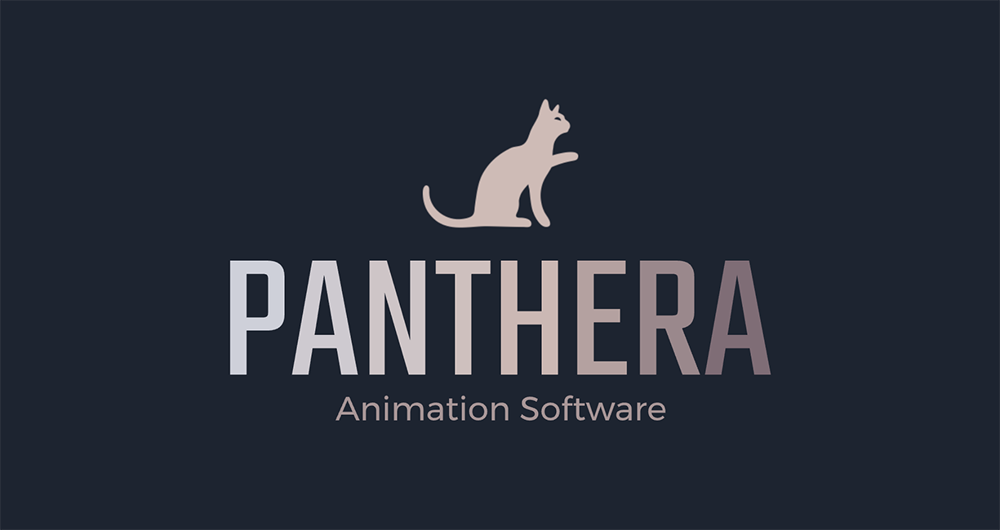

 

**Panthera** - the online tool for visual creating animation for **Defold**

## Features

### Online editor features
- Custom online editor with various export for _Defold_ animate functions _(both go and gui)_
- Properties supported: _position_, _scale_, _size_, _rotation_, _color_, _slice9_
- Add different triggers at specific time (events, set node state, set images, etc)
- Use stub node or upload image for every node
- Create you nodes layout as in your game scene or specific entity
- Save, load, copy, import or export your projects
- Undo / Redo!
- Full [Druid](https://github.com/Insality/druid/) powered **Defold** project

## Manual

[See the Manual here](manual.md) to learn Panthera Editor

## License

- Developed and supported by [Insality](https://github.com/Insality)

## Issues and suggestions

If you have any issues, questions or suggestions please [create an issue](https://github.com/Insality/panthera-editor/issues) or contact me: [insality@gmail.com](mailto:insality@gmail.com)

## Other links

- [Future Plans](future_plans.md)

## ❤️ Support project ❤️

 
